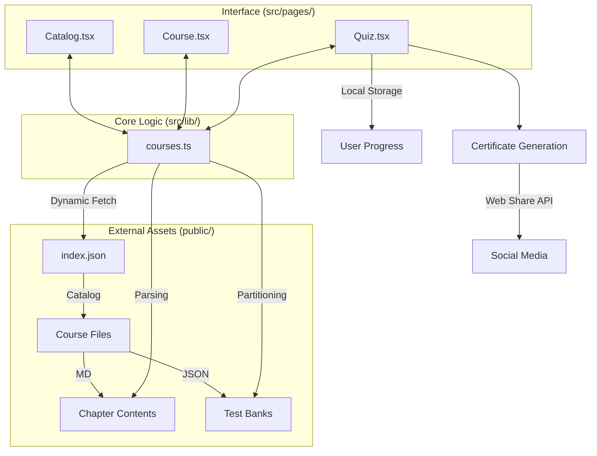

# ⚡ SkillFlash Academy

[](https://reactjs.org/)
[](https://vitejs.dev/)
[](https://www.typescriptlang.org/)
[](https://tailwindcss.com/)
[](https://opensource.org/licenses/MIT)

**SkillFlash Academy** est une plateforme de micro-learning d'élite conçue pour une montée en compétences ultra-rapide. Grâce à un catalogue dynamique et une interface hautement interactive, les apprenants peuvent maîtriser les technologies digitales les plus demandées en quelques minutes par jour.

---

## ✨ Fonctionnalités "Élite"

- 🎓 **Catalogue Dynamique de 12 Formations** : Couvrant le Développement (React, Python, JS), le Design (Figma, Design Fundamentals), le Business (Marketing, LinkedIn) et le DevOps (Docker, Kubernetes).
- 📖 **Expérience de Lecture Immersive** : Sidebar sticky, typographie aérée et parcours séquentiel fluide pour une absorption maximale du contenu.
- ⏱️ **Examen de Certification Chronométré** : Un test complet combinant 20 QCM et 5 Questions de Réflexion (QR) pour valider une expertise réelle.
- ⏸️ **Contrôle Total** : Mise en pause de l'examen et sauvegarde de la progression pour une flexibilité maximale.
- 🏆 **Génération de Diplômes PNG** : Certificats haute fidélité générés à la volée avec score de réussite et code de vérification unique.
- 📱 **Partage Social Natif** : Partage direct du fichier image de la certification sur LinkedIn, WhatsApp et réseaux sociaux via la Web Share API.

---

## 🛠️ Stack Technologique

SkillFlash utilise une architecture moderne "Headless Content" sans base de données SQL complexe pour une rapidité d'exécution et une scalabilité optimale.

| Layer | Technologies |
| :--- | :--- |
| **Frontend** | React 18 (Hooks, Suspense), Vite |
| **Styling** | Tailwind CSS (Design System), Radix UI (Primitives) |
| **Data Fetching** | TanStack Query (React Query) |
| **Content Engine** | Markdown (remark-gfm), JSON Dynamics |
| **Media/Assets** | html-to-image, Lucide React Icons |
| **Notifications** | Sonner |

---

## 📐 Architecture Technique

Le flux de données de SkillFlash repose sur une séparation stricte entre le moteur de lecture et les actifs pédagogiques.



---

## 🚀 Installation & Lancement

### Pré-requis
- Node.js (v18+)
- npm ou yarn

### Setup Local
1. Clonez le repository
2. Installez les dépendances :
   ```bash
   npm install
   ```
3. Lancez le serveur de développement :
   ```bash
   npm run dev
   ```

---

## ✍️ Guide de Personnalisation : Ajouter un Cours

Il n'est pas nécessaire de toucher au code (`src/`) pour ajouter ou modifier des cours. Tout se passe dans le dossier `public/`.

1. **Déclarer le cours** : Ajoutez une entrée dans `public/courses/index.json`.
2. **Créer le dossier** : Créez un sous-dossier `public/courses/[votre-id]/`.
3. **Rédiger les chapitres** : Créez 10 fichiers `chapter-1.md` à `chapter-10.md` dans ce dossier.
4. **Configurer les tests** : Ajoutez vos questions dans `public/tests/qcm/[votre-id]_qcm.json` et `public/tests/qr/[votre-id]_qr.json`.

---

## 📄 Licence

Ce projet est distribué sous licence MIT. Voir le fichier `LICENSE` pour plus de détails.

---

© 2026 SkillFlash Academy • Conçu pour l'Excellence.
